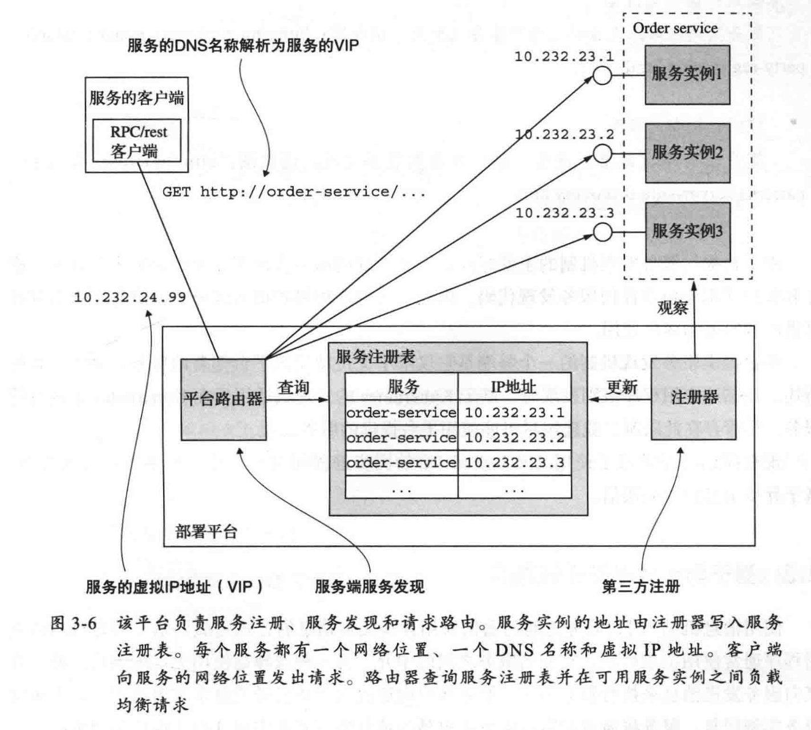

# 微服务架构设计模式


## 进程间通信方式


### 基于同步远程过程调用的通信

两种实现方式：`REST` 和 `gRPC`，简单对比：

|      | REST                               | gRPC                                   |
| ---- | ---------------------------------- | -------------------------------------- |
|      | 简单，熟悉                         | 需要提供函数签名，具有学习门槛         |
|      | Postman 和 前端 可以直接调用，方便 | JS 客户端使用 gRPC 的 API 需要额外操作 |
|      | 仅支持简单的 请求/响应 模型        | 支持 `数据流` 方式的消息推送           |
|      | 性能较为一般，特别是传输数据量大   | 高效紧凑的通讯方式，得益于 Protobuf    |
|      | 历史悠久，兼容性高                 | 可能部分防火墙无法支持 HTTP/2          |

两个问题：局部故障处理 和 服务注册与发现

**局部故障处理**使用熔断器来进行实现，防止服务雪崩，常见的有：`Hystrix`，结合 Feign 来实现 REST 的远程过程调用：

```java
@Component
public class DeptHystrixFallBackService implements DeptHystrixService {
    @Override
    public String deptInfo_Ok(Integer id) {
        return "--------------------C语言中文网提醒您，系统繁忙，请稍后重试！（解耦回退方法触发）-----------------------";
    }
    @Override
    public String deptInfo_Timeout(Integer id) {
        return "--------------------C语言中文网提醒您，系统繁忙，请稍后重试！（解耦回退方法触发）-----------------------";
    }
}

@Component
@FeignClient(value = "MICROSERVICECLOUDPROVIDERDEPTHYSTRIX", fallback = DeptHystrixFallBackService.class)
public interface DeptHystrixService {
    @RequestMapping(value = "/dept/hystrix/ok/{id}")
    public String deptInfo_Ok(@PathVariable("id") Integer id);
    @RequestMapping(value = "/dept/hystrix/timeout/{id}")
    public String deptInfo_Timeout(@PathVariable("id") Integer id);
}
```

结合其他方法来进行熔断：

```java
    //一旦该方法失败并抛出了异常信息后，会自动调用  @HystrixCommand 注解标注的 fallbackMethod 指定的方法
    @HystrixCommand(fallbackMethod = "dept_TimeoutHandler",
            commandProperties =
                    //规定 5 秒钟以内就不报错，正常运行，超过 5 秒就报错，调用指定的方法
                    {@HystrixProperty(name = "execution.isolation.thread.timeoutInMilliseconds", value = "5000")})
    @Override
    public String deptInfo_Timeout(Integer id) {
        int outTime = 6;
        try {
            TimeUnit.SECONDS.sleep(outTime);
        } catch (InterruptedException e) {
            e.printStackTrace();
        }
        return "线程池：" + Thread.currentThread().getName() + "  deptInfo_Timeout,id:   " + id + "  耗时: " + outTime;
    }
    // 当服务出现故障后，调用该方法给出友好提示
    public String dept_TimeoutHandler(Integer id) {
       return  "C语言中文网提醒您，系统繁忙请稍后再试！"+"线程池：" + Thread.currentThread().getName() + "  deptInfo_Timeout,id:   " + id;
    }
```

为当前类所有方法添加默认的熔断规则：

```java
@Slf4j
@RestController
@DefaultProperties(defaultFallback = "dept_Global_FallbackMethod") //全局的服务降级方法
public class HystrixController_Consumer {
  // 依然需要为其中每个方法添加 @HystrixCommand 注解，但不需要单独制定 fallbackMethod
	……
}
```

> 需要对每个同步调用都进行这个处理，否则没有兜底的逻辑了，fallback 当中处理的常见方式：
>
> * 给默认值
> * 从缓存当中拿数据
> * 返回错误码给调用方


**服务注册与发现**，也存在两种主流方式：

* 服务及其客户直接与服务注册表进行交互（Eureka、Zookeeper、Nacos似乎都属于这种）
* 通过基础部署设施来处理服务发现（后面 12 章补充）


第一种和服务注册表的交互包含两个部分：服务自注册（自注册 + 健康检查 + [ 心跳API ]） + 客户端发现（负载均衡算法选择实例）

>  Spring Cloud 存在很多个版本，如默认的 Netflix 版本，国内的 Alibaba 版本，都提供了这一套微服务部署的落地方案，如在默认的 Spring Cloud 中默认集成 Netflix 的 Eureka 来做服务发现与注册，Alibaba 使用 Nacos 来进行服务发现与注册，都只不过是服务注册表这个概念的不同落地实现方式。

往往是在应用层当中去完成，而不是基于部署环境如 Kubernetes 的服务发现来进行的，因为部署环境可能存在多套，可以处理多部署平台的问题，但缺点是需要自身实现服务发现与注册功能，需要手动去管理服务注册表，会花费一定精力，推荐使用基础设施方案


第二种方案则与部署平台强绑定，如 Kubernetes 本身就具有服务发现与注册的功能，服务注册、服务发现和请求路由完全由部署平台处理，只需要对外暴露一个 Virtual IP即可**【推荐】**

包含两个部分：第三方注册模式（由平台注册器完成服务注册） + 服务端发现模式（平台路由器完成服务发现），从此无需上层应用基于语言环境寻找对应框架来手动完成服务发现与注册

实现原理：



