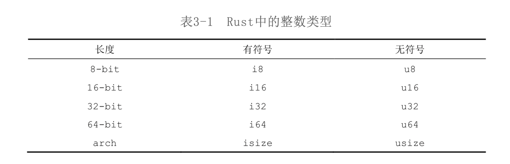
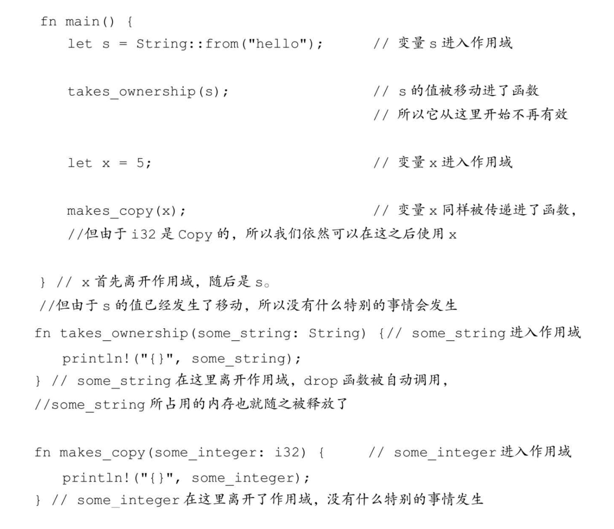
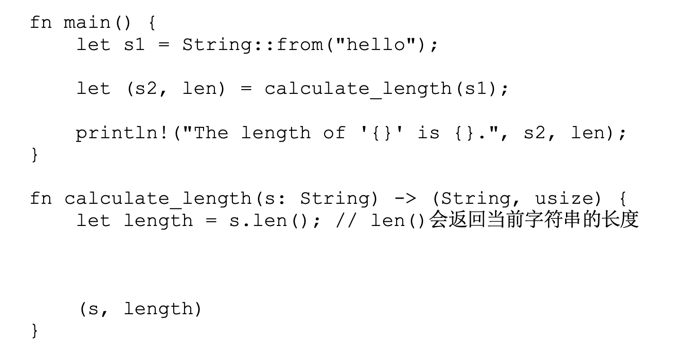
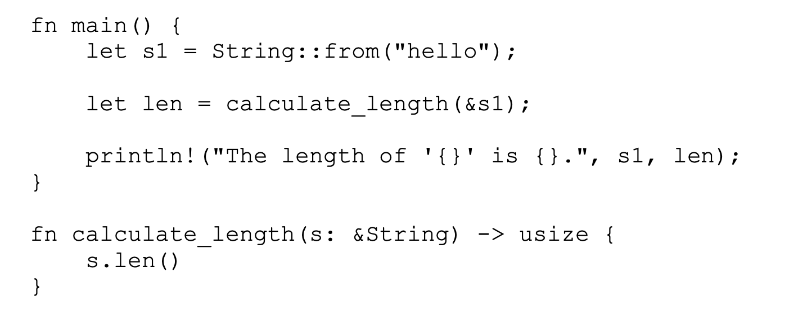

# Rust 编程语言

最大特点：编译期检查、安全、高效

## 入门指南

更为现代化，底层依赖 C & C++，似乎所有的高级语言底层皆依赖于此，具有比较完备的开发工具和工具链 `rustup`

macOS安装 Rust：`curl https://sh.rustup.rs -sSf | sh`

Rust 更新：`rustup update`

Rust 卸载：`rustup self uninstall`

查看当前 Rust 版本号：`rustc --version`

查看 Rust 帮助文档：`rustup doc`

格式化代码：`rustfmt main.rs`

常规的 Hello World 环节：

```rust
fn main() {
    println!("Hello, world!");
} 
```

**带 `!` 的是完成对宏的调用而非普通函数的调用**

使用 `ructc {file}`来完成 `.rs` 文件的编译，编译完成后即可将编译文件交付给别人，无需依赖使用环境，和解释型语言不同

单个文件使用 rust` 足以应付，但大型项目需要构建工具，Rust官方提供了：Cargo，是一个构建系统及包管理器

使用 Cargo 来创建项目：`cargo new {project}`

当前工作目录：

```
project
---- .git
---- Cargo.toml
// 编译后出现，指定当前依赖 Crate 版本，避免默认版本升级导致问题，保证构建可重现，后期如果需要升级，直接修改 Cargo.toml 没用[在 Cargo.toml 当中仅仅指定的是最低版本，因为 Rust Library 要求向后兼容，实际引用的或许不是这个版本]，要使用 cargo update 来完成升级库的检查工作，成功后会再次写入到该文件当中去，默认 0.3.x 无法升级到 0.4.x，需要使用 Cargo.toml 将最低版本改成 0.4.0 [小版本兼容，和 Maven 一样]
---- Cargo.locl
---- src
	---- main.sr
```

Cargo.html 无限接近于 Java 世界当中的 pom.xml

```toml
[package]
name = "hello_cargo"
version = "0.1.0"
edition = "2021"

# See more keys and their definitions at https://doc.rust-lang.org/cargo/reference/manifest.html

[dependencies]
```

使用 Cargo 编译项目：`cargo build`，构建成功的输出在：`target/debug/` 下，可以直接运行，也可以使用 `cargo run` 的方式来依次**完成编译和运行任务**

使用 `cargo check` 来检查是否可以通过编译，而不需要花费额外的时间来生成可执行文件，往往 Rust 开发者会周期性使用这个命令来检查是否能通过编译

> 基于前文所述，Rust 在编译过程当中可以发现绝大多数 Bug，应该是花了大力气在这上面的，所以 check 这条命令很有价值

当修改完成后使用：`cargo build --release` 来完成 release 文件的打包，这种模式会花费更长的编译时间来优化代码，后续的性能基准测试也要基于此


## 猜字游戏

Demo1：Finish input and output

```rust
use std::io;                                                                                           

fn main() {
    println!("Guess the number!");

    println!("Please input your guess.");

  	// variable in rust default is immutable, use mut keyword let variable mutable
    let mut guess = String::new();
  	// let guess = 2

  	// reference is same sa variable default is immutable, use keyword mut let reference mutable
    io::stdin().read_line(&mut guess)
  			// 对 read_line 函数返回的 Result 进行处理，默认都需要处理 Result
  			.expect("Failed to read line");

    println!("You guessed: {}", guess);
}
```

我们通常构建的可执行的包（Crate）是：Binary Crate，而可复用功能库是：Library Crate

需要的依赖包可以在：cargos.io 当中进行搜索


## 通用编程概念

Rust 变量默认不可变，为了可以安全方便的写出复杂，甚至是并行的代码【保证线程安全的几个方式，级别由高到低：线程私有、对象不可变或者事实不可变、线程安全的对象、持有锁来访问的保护对象】，Rust 采用了除去完全避免并发外的最高一种安全级别

Rust 推荐使用在数据类型需要修改的时候使用隐藏机制：使用后面声明的对象代替前面的对象

```rust
let spaces = "     ";
// 已经是不同的数据类型了 从 String -> i32 而无需进行更换名字，推荐使用这种方式进行覆盖
let spaces = spaces.len();
```

常量声明方式：

```rust
// 需要声明数据类型
const MAX_POINTS: u32 = 100_000;
```

Rust 数据类型分两种：标量类型（Scalar：something that has size but no direction）和复合类型（Compound：something that consist of two or more different parts）

Scalar：Rust 内置四种 Scalar 类型：整数、浮点数、布尔值和字符

整型由于大部分机器（包含 64 bit）都是 i32 效率更高，默认使用



> Rust 对益处的处理，在默认的 Debug 环境下会报错 panic，而 release 时候会自动将溢出转换为最小值

浮点类型包含：f32 和 f64 性能相差无几，默认使用 f64

布尔类型：true 和 false，占单个字节

字符类型：使用单引号，占四字节，使用 Unicode 编码

Compound：将多个不同类型的值组合为一个类型，包含元组（tuple） 和数组（array）

元组：**固定长度的数组，可以是不同的类型**，创建完成后不可变

```rust
fn main() {                                                                                            
    let tup = (200, 5.0, true);

    // through destructuring to access element in tuple
    let (x, y, z) = tup;
    println!("{}", x); 
    println!("{}", y); 
    println!("{}", z); 

    // through character . to access element
    println!("through operation . to get result: {}", tup.1);
}
```

数组：**固定长度的数组，必须是相同的类型**，创建完成后不可变

```rust
let array: [i32, 5]= [1, 2, 3, 4, 6];
let array: [i32, 8] = [3 ; 8];
println!("{}", array[1]);
```

Rust 是静态类型语言，意味着需要在编译时候知道所有变量的具体类型，大部分情况下 Rust 编译器可以推导出具体的数据类型来，但有些时候如调用 parse 将 String 转换成 i32 或 u32 的时候此时需要手动注明

Rust 函数的创建和使用：

```rust
fn main() {                                                                                            
    println!("Hello, world!");

    another_function();
    another_function_with_argument(123);
    another_function_with_one_more_argument(123, 'c');
    println!("function plus one return: {}", function_plus_one(2));
}

fn another_function() {
    println!("Another function.");
}

// required explicit insturction argument type
fn another_function_with_argument(param: i32) {
    println!("function with argument print: {}", param);
}

fn another_function_with_one_more_argument(param1: i32, param2: char) {
    println!("first param is : {}", param1);
    println!("second param is : {}", param2);
}

fn function_plus_one(param: i32) -> i32 {
    param + 1 
}
```

函数可以以语句或者表达式结尾，语句是执行操作但不返回值的指令，而表达式是执行操作并返回值的指令，简单判断一个指令是表达式还是语句，可以判断 `let result = <command>` 是否合法，Rust 是一门基于表达式的语言

```rust
let expression_result = {
  let x = 3;
  x + 1			// 没有加上分号，如果加上了就成语句了，而不是表达式了
}
```

条件：

```rust
fn base_branch_operate() {
    let number = 3;

    if number % 4 == 0 {
        println!("number is divisible by 4");
    } else if number % 3 == 0 {
        println!("number is divisible by 3");
    } else if number % 2 == 0 {
        println!("number is divisible by 2");
    } else if number % 1 == 0 {
        println!("number is divisible by 1");
    } else {
        println!("this number not exist!");
    }
}

fn advanced_branch_operate() {
    let condition = true;

    let number = if condition {
        5
    } else {
        6
    };

    println!("number value is {}", number);
}
```

循环：

```rust
fn loop_operation() {
    let mut counter = 0;
        
    let result = loop {
        counter += 1;

        if counter == 10 {
            break counter * 2;
        }   
    };  

    println!("result is {}", result);
}

fn while_operation() {
    let mut number = 3;

    while number != 0 {
        number = number - 1;
    }

    println!("{}", number);
}

fn for_operation() {
    let tuple = [20; 15];

    for element in tuple.iter() {
        println!("element is {}", element);
    }
} 
```


## 所有权

概念：与常规的使用垃圾回收或者手动释放内存的方式不同，所有权是第三种内存管理方式，允许编译器在编译过程当中执行检查工作，而不会产生任何的运行时开销。

> 理解所有权概念需要理解堆栈，Rust 对堆栈的操作有直观的感受，处理器在处理排列紧密的数据（栈）时要比处理排布稀疏的数据（堆）效率高，且寻址次数越多，性能往往越差（缓存优化，较低的跳转次数更大可能命中缓存）
>
> 绝大多数编程语言需要记录你分配的堆空间，最小化堆上的冗余数据。
>
> Rust Scalar类型都是直接在栈上进行分配的，其他的 Compound 数据类型则会直接被分配到堆当中

所有权规则：

* Rust 当中的每一个值都有一个对应的变量作为他的所有者。
* 在同一时间内，值有且仅有一个所有者

```rust
fn main() {                                                                                            
    let string1 = String::from("sample");
  	// rust 当中使用 move 代替浅拷贝，string1 被 move 到了 string2 当中
  	// Rust 永远不会在赋值操作中执行拷贝，因为相当消耗资源，需要手动 clone
  	// 例外：如果是 Scalar 基本数据类型，则直接执行深拷贝操作，因为是存储在栈上，复制相当快
    let string2 = string1;

  	// 此时 string1 已经不可用
    println!("{}",string2);
}
```

* 当所有者离开自己的作用域时，他持有的值就会被释放掉

**将值传递给函数在语义上类似于给变量进行赋值，将变量传递给函数将会触发移动或者复制**



将变量作为方法返回值也可以作为当前变量作用域的延续

为了避免以下代码的产生



Rust 使用引用传递来进行优化，引用允许你在不获取所有权的前提下使用值



这种通过引用传递参数给函数的方法也被称为借用（Borrowing），不允许去修改引用的值，但可以使用可变引用来解


有一个很大的限制是，对一个作用域当中的一个变量只能声明一个可变引用，为了防止竟态条件：

* 两个或两个以上的指针同时访问一片内存空间
* 至少有一个指针会向空间中写入数据
* 没有数据同步的机制

不能在不可变引用指向的变量创建可变引用

* 在任何一段给定的时间里，你要么只拥有一个可变引用，要么只能拥有任意数量的不可变引用
* 引用总是有效的（编译器保证，保证在使用时当前变量未被回收）

Rust 当中持有所有权的两种类型：引用 和 切片，前面都是引用，**切片允许我们引用集合中某一段连续的元素序列，而不是整个集合**

String 切片引用：

```rust
let string = String::from("hello world!");

// 字符串切片
let hello = &string[0..5];
let hello_replace = &string[..5];
let world = &string[6..11];
let world_copy = &string[6..];

let whole_string = &string[..];
```

切片使用：

```rust
fn main() {                                                                                                       
    let source = String::from("hello world");
    let result = first_world(&source);
    println!("{}", result);
  	// 这里会报错：cannot borrow `source` as mutable, as it is not declared as mutable &source
    source.clear();
}

// 定义方法接口时推荐以 字符串切面 代替 字符串引用
fn first_world(source: &str) -> &str {
    let bytes = source.as_bytes();

    for (i, &item) in bytes.iter().enumerate() {
        if item == b' ' {
            return &source[..i];
        }   
    }   

    &source[..]
}
```

字符串字面量就是切面，被存储到二进制程序中，直接以切片  `&str` 的方式来进行引用，正是由于 `&str`是不可变的，因此字符串字面量就是不可变的了。

使用权，借用和切片的逻辑都是为了方便进行清除所有者离开了作用域的数据


## 结构体

Demo：

```rust
// 增加 Debug 打印 trait
#[derive(Debug)]                                                                                       
struct Rectangle {
    width: u32,
    height: u32,
}

fn main() {
    let rectangle = Rectangle {width: 30, height: 50};

    println!("Rectangle info: {:?}", rectangle);

    println!("Rectangle area is {}", area(&rectangle));
}

fn area(rectangle: &Rectangle) -> u32 {
    rectangle.width * rectangle.height
}
```

使用方法来将 area 归属到 struct 当中去

> 函数和方法是两个类型的概念，方法被定义在结构体（枚举类型、Trait对象）的上下文中，并且他们的第一个参数永远是 `slef`，用于代指该方法的结构体实例
>
> > Java 中一切皆对象，静态方法更适合叫内联函数，其他的都是方法

```rust
#[derive(Debug)]                                                                                       
struct Rectangle {
    width: u32,
    height: u32,
}

impl Rectangle {
  	// 通常无需获得所有权，也无需修改
    fn area(&self) -> u32 {
        self.width * self.height
    }   

    fn can_hold(&self, target: &Rectangle) -> bool {
        self.width >= target.width && self.height >= target.height
    }   
}

fn main() {
    let rectangle = Rectangle {width: 30, height: 20};
    let rectangle2 = Rectangle {width: 30, height: 20};

    println!("result: {}", rectangle.can_hold(&rectangle2));
}
```

从属于 struct 的还有一个关联函数，通过函数这个名字知道他无需传入 `&self`，等同于 Java 的静态方法，一般用作构造器

```rust
fn square(size: u32) -> Rectangle {
  Rectangle {width: size, height: size}
}
```


## 枚举与模式匹配

简单的枚举处理：

```rust
#[derive(Debug)]
enum IpAddress {
    IP_V4(String),
    IP_V6(String)
}

fn main() {
    let ip_enum = IpAddress::IP_V4(String::from("123"));
    println!("IpAddress : {:?}", ip_enum);
}
```

`Option<T>`本质上也是一个枚举，其中包含：`NONE` 和 `Some`：

```rust
fn plus_one(x: Option<i32>) -> Option<i32> {
    match x { 
        None => None,
        Some(i) => Some(i + 1)
    }   
}

fn main() {
    let five = Some(5);
    let six = plus_one(five);
    println!("some: {:?}", six);
}
```

高级用法：

```rust
fn main() {
    match_language_advance();
    let some_u8_value = 0u8;
    match some_u8_value {
        1 => println!("{}", some_u8_value),
        _ => ()
    }
}

fn match_language_advance() {
    let some = Some(1);
  	// if let 等价于 match case else execute ()
    if let Some(i) = some {
        println!("{}", i);
    }
}

// equals to below
fn match_language_advance() {
    let some = Some(1);
    if let Some(2) = some {
        println!("{}", 2);
    } else {
        println!("{}", 333)
    }
}
```


## 使用包、单元包及模块来管理日渐复杂的项目

一个包（Package）可以拥有多个二进制单元包及一个可选的库单元包，还可以将部分代码拆到独立的单元包（Crate）当中。

概念说明：

* 包（Package）：一个用于构建、测试并分享单元包的 Cargo 功能
* 单元包（Crate）：一个用于生成库或可执行文件的树形模块结构
* 模块（Module）及 use 关键字：控制文件结构，作用域及路径的私有性
* 路径（Path）：一种用于命名条目的方法，这些条目包括：结构体、函数和模块等

Package 是由一个或多个提供相关功能的单元包集合而成

执行 `cargo new` 完成包的创建，默认仅存在 `main.rs` 二进制单元包的根结点，可以手动创建 `lib.rs` 会被视作当前包的库单元包的根结点，可以在路径：`src/bin` 下创建多个源文件来创建更多的二进制单元包（Cargo）

默认的访问级别都是私有的

```rust
// soame level node, so it no need to mark pub
mod fornt_of_house {
    pub mod hosting {
        pub fn add_to_waitlist() {}
    }
}

pub fn eat_at_restaurant() {
  	// in same file wu also need mark mod and func as public
  	// path from current file 
    fornt_of_house::hosting::add_to_waitlist();
}
```

需要根据模块路径来完成方法调用，可以使用绝对路径从 `cargo` 根目录来查找，也可以使用相对路径从当前的文件开始查找，可以使用关键字 `super` 逆向查找 parent module，也可以使用 `::` 完成 child module 查找。

结构体声明为 `pub`，所有字段仍然默认是私有的，含有私有字段的结构体需要一个关联构造函数来完成构造。

枚举声明为 `pub`，则其中所有字段默认为 `pub`


## 通用集合类型

数据的大小在编译期间不确定，并且随着程序的按需扩大或缩小数据占用的空间。

* 动态数组（Vector）
* 字符串（String）
* 哈希映射（HashMap）

Vector 使用：

```rust
fn main() {
    let create_vec_default: Vec<i32> = Vec::new();
    let mut create_vec_with_init_value = vec![1, 2, 3];
    create_vec_with_init_value.push(3);

    println!("{:?}", create_vec_with_init_value);

    // get element from index
    let index2 = &create_vec_with_init_value[1];
    println!("{}",index2);

    // get element from get func
    let index2_from_func_get = create_vec_with_init_value.get(9);
    if let Some(i) = index2_from_func_get {
        println!("{}", i);
    } else {
        println!("nothing in index 1");
    }

    // print all elements in vector
    for element in create_vec_with_init_value{
        println!("{}", element);
    }
}
```

String 使用：

```rust
use std::fmt::format;

fn main() {
    let source_string = "init contents";
    
    // equals
    let mut s = source_string.to_string();
    let s_equals = String::from(source_string);
    
    // add contents to string
    s.push_str("append");

    let param1 = "hello_".to_string();
    let param2 = "world".to_string();
    // paran1 owner transfer，param2 still get the owner
    let result = param1 + &param2;
    println!("result: {}", result);

    // format string replace with add operation
    let format_string = format!("{} - {}", "hello", "world");
    println!("format string is {}", format_string);

    // iterate all element in string
    let string_get_all_element = "abc";
    // byte level
    for byte in string_get_all_element.bytes() {
        println!("byte: {}", byte);
    }

    // char level
    for char in string_get_all_element.chars() {
        println!("char: {}", char);
    }
}
```

Map 用法：

```rust
use std::{collections::HashMap, fmt::format};

fn main() {
    word_calculate();
}

fn string_operate() {
    let source_string = "init contents";

    // equals
    let mut s = source_string.to_string();
    let s_equals = String::from(source_string);

    // add contents to string
    s.push_str("append");

    let param1 = "hello_".to_string();
    let param2 = "world".to_string();
    // paran1 owner transfer，param2 still get the owner
    let result = param1 + &param2;
    println!("result: {}", result);

    // format string replace with add operation
    let format_string = format!("{} - {}", "hello", "world");
    println!("format string is {}", format_string);

    // iterate all element in string
    let string_get_all_element = "abc";
    // byte level
    for byte in string_get_all_element.bytes() {
        println!("byte: {}", byte);
    }

    // char level
    for char in string_get_all_element.chars() {
        println!("char: {}", char);
    }
}

fn hash_map_operate() {
    // base create HashMap
    let mut map = HashMap::new();

    map.insert("key".to_string(), 1);

    // advanced create HashMap
    let team_name = vec!["bule", "yellow"];
    let team_source = vec![10, 50];
    // through Vector index to create HashMap
    let team: HashMap<_, _> = team_name.iter().zip(team_source.iter()).collect();
    println!("{:?}", team);

    let mut map = HashMap::new();
    // owner transfer
    map.insert("key1".to_string(), 1);
    map.insert("key2".to_string(), 2);

    println!("{:?}", map.get("key1"));

    // iterate all element in map
    for (key, value) in &map {
        println!("key: {}", key);
        println!("value: {}", value);
    }

    // replace old value: direct insert
    map.insert("key1".to_string(), 111);
    println!("key1: {:?}", map.get("key1"));
    
    // insert map if key is not exist
    map.entry("key1".to_string()).or_insert(1);
    println!("key1: {:?}", map.get("key1"));

    // operate exist value
    let value = map.entry("key1".to_string()).or_insert(1);
    *value += 1;
    println!("{:?}", map.get("key1"));
}

fn word_calculate() {
    let mut map = HashMap::new();
    let words = "hello world hello java hello rust hello cpp";

    for word in words.split_whitespace() {
        let count = map.entry(word).or_insert(0);
        *count += 1;
    }

    println!("{:?}", map);
}
```


## 错误处理

```rust
use core::panic;

fn main() {
    // automic panic
    let vec = vec!(1, 2, 3);
    println!("{}", vec[11]);

    // manual panic
    panic!("crash and burn!");
}

```

通过 `panic!` 宏的方式来完成**不可恢复错误**的抛出

当前抛出信息：

```
thread 'main' panicked at 'index out of bounds: the len is 3 but the index is 11', src/main.rs:6:20
stack backtrace:
   0: rust_begin_unwind
             at /rustc/fc594f15669680fa70d255faec3ca3fb507c3405/library/std/src/panicking.rs:575:5
   1: core::panicking::panic_fmt
             at /rustc/fc594f15669680fa70d255faec3ca3fb507c3405/library/core/src/panicking.rs:64:14
   2: core::panicking::panic_bounds_check
             at /rustc/fc594f15669680fa70d255faec3ca3fb507c3405/library/core/src/panicking.rs:147:5
   3: <usize as core::slice::index::SliceIndex<[T]>>::index
             at /rustc/fc594f15669680fa70d255faec3ca3fb507c3405/library/core/src/slice/index.rs:260:10
   4: core::slice::index::<impl core::ops::index::Index<I> for [T]>::index
             at /rustc/fc594f15669680fa70d255faec3ca3fb507c3405/library/core/src/slice/index.rs:18:9
   5: <alloc::vec::Vec<T,A> as core::ops::index::Index<I>>::index
             at /rustc/fc594f15669680fa70d255faec3ca3fb507c3405/library/alloc/src/vec/mod.rs:2727:9
   6: error_handle::main
             at ./src/main.rs:6:20
   7: core::ops::function::FnOnce::call_once
             at /rustc/fc594f15669680fa70d255faec3ca3fb507c3405/library/core/src/ops/function.rs:507:5
note: Some details are omitted, run with `RUST_BACKTRACE=full` for a verbose backtrace.
```

**可恢复错误**与 Result

```rust
// for using ? operate
fn main() -> Result<(), Box<dyn Error>> {
    let string = fs::read_to_string("hello.txt")?;
    println!("{}", string);

    Ok(())
}

fn result_operate() {
    let file = File::open("hello.txt");

    let file = match file {
        Ok(actual_file) => actual_file,
        Err(error_message) => {
            panic!("while open file occur error: {:?}", error_message);
        }
    };
}

fn result_operate_simple() {
    // unwrap func get value from Result if exist or execute panic!
    let file = File::open("hello.txt").unwrap();

    let get_file_advance = File::open("hello.txt").expect("get file hello.txt get an error");
}

fn result_operate_advance() {
    let file = File::open("hello.txt");

    let file = match file {
        Ok(actual_file) => actual_file,
        Err(error) => match error.kind() {
            ErrorKind::NotFound => match File::create("hello.txt") {
                Ok(fc) => fc,
                Err(create_error) => panic!("create file error: {:?}", create_error),
            },
            other_error => panic!(
                "there was an error occur when open a file, error: {:?}",
                other_error
            ),
        },
    };
}

fn read_username_from_file() -> Result<String, std::io::Error> {
    let file = File::open("hello.txt");
    let mut file = match file {
        Ok(f) => f,
        Err(error) => return Err(error)
    };

    let mut string = String::new();
    match file.read_to_string(&mut string){
        Ok(_) => Ok(string),
        Err(e) => Err(e)
    }
}

fn read_username_from_file_streamline() -> Result<String, io::Error> {
    // ? operate ---- if (ok) => get value and goon else return Error
    // limit condition: only work on func that return Result
    let mut file = File::open("hello.txt")?;
    let mut string = String::new();
    file.read_to_string(&mut string)?;
    Ok(string)
}

fn read_username_from_file_streamline_chain_call() -> Result<String, io::Error> {
    let mut string = String::new();
    File::open("hello.txt")?.read_to_string(&mut string)?;

    Ok(string)

    // all euqlas to 
    // fs::read_to_string("hello.txt")
}
```


## 泛型、trait与生命周期

泛型（Generics）是具体类型的抽象替代。

```rust
struct Point<T> {
    x: T,
    y: T
}

struct AdvancedPoint<U, T> {
    x: U,
    y: T
}

enum AdvancedResult<R, E, T> {
    Result(R),
    Exception(E),
    Transfer(T)
}

// specify generics can add method to specifical object
impl<R, E, T> AdvancedResult<R, E, T> {
    fn object_method(&self, array1: &T) {
        
    }
}

fn main() {
}

fn find_max_value<T>(list: &[T]) -> T{
    let mut max = list[0];

    for &item in list.iter() {
        if (item > max) {
            max = item;
        }
    }

    max
}
```


trait 与其他语言当中接口的概念类似，但也不尽相同，需要保证 `trait` 和类型至少有一个在当前库中，否则会报错，这就是孤儿规则，避免别人引用了你的库时，是用了trait，而你自己原来也会这个类型使用了trait，编译器不知道要使用哪一个实现

```rust
use std::{fmt::Display, iter::Sum};

pub trait Summary {
    fn summarize(&self) -> String;
    fn summarize_default(&self) -> String {
        "summarize default method return".to_string()
    }
}

pub struct NewsArticles {
    pub headline: String,
    pub auther: String,
}

impl Summary for NewsArticles {
    fn summarize(&self) -> String {
        format!("{}, by {}", self.headline, self.auther)
    }
}

pub fn notify(item: impl Summary) {
    print!("result: {}", item.summarize());
}

pub fn notify_another<T: Summary>(array1: T, array2: T) {}

pub fn notify_with_multi_trait(item: impl Summary + Display) {}

pub fn notify_with_multi_trait_another<T: Summary + Display>(array1: T, array2: T) {}

pub fn notify_with_multi_trait_another_where_enhance<T>(array1: T, array2: T)
where
    T: Summary + Display,
{
}

// 不支持返回类型不明确，如
// if return A (implements trait) else return B (implements trait)
pub fn return_value_implements_trait() -> impl Summary {
    NewsArticles {
        headline: "headline".to_string(),
        auther: "author".to_string(),
    }
}

fn main() {
    let article = NewsArticles {
        headline: "headline".to_string(),
        auther: "auther".to_string(),
    };
    print!("{}", article.summarize());
}

```

trait best practice: 

```rust
fn get_largest_number<T>(list: &Vec<T>) -> &T
where
    T: PartialOrd,
{
    let mut max = &list[0];
    for item in list.iter() {
        if (item > max) {
            max = item;
        }
    }

    &max
}

fn main() {
    let vector = &vec![1, 2, 3];
    let largest = get_largest_number(vector);
    println!("largest is : {}", largest);
}
```

根据泛型实现的 trait 来决定是否存在一些方法：

```rust
struct Couple<K, V> {
    x: K,
    y: V,
}

impl<K, V> Couple<K, V> {
    fn all_couple_have_method() {}
}

impl<K, V> Couple<K, V>
where
    K: Display,
    V: PartialOrd,
{
    fn k_impl_display_and_v_impl_partialOrd_have_method() {
        
    }
}
```

生命周期引发的问题（borrow生命周期远远大于当前变量的生命周期）：

```rust
fn main() {
    let out_reference;
    {
        let inner_value = 1;
        // 借用的生命周期可能要短于当前变量的生命周期
        // 需要考虑被引用对象的生命周期是否小于引用者，即需要数据始终有效
        out_reference = &inner_value;
        // `inner_value` does not live long enough
    }

    println!("{}", out_reference);
    // borrow later used here
}

```

```rust
// 两个字符串切面的存活时间，必须不短于给定的生命周期
// 并未延长变量的生命周期，仅仅只是完成生命周期的声明，明确告知编译器当前变量的生命周期最少为 'a
// rust 可以轻松完成函数体内部生命周期的判断，至于方法层级的调用，则需要我们自己指定
fn longest_string<'a>(str1: &'a str, str2: &'a str) -> &'a str {
    if (str1.len() > str2.len()) {
        str1
    } else {
        str2
    }
}
fn main() {
    over_lifetime();
}

fn normal_lifetime() {
    let longest_string = longest_string("test1", "testLongest");
    println!("{}", longest_string);
}

// 超出生命周期的 Demo
fn over_lifetime() {
    let string1 = "hello".to_string();
    let result;
    {
        let string2 = "world1".to_string();
        // error: `string2` does not live long enough
        result = longest_string(string1.as_str(), string2.as_str());
    }
    println!("{}", result);
}

```

出现生命周期的概念，是因为编译器无法确定对象的生命周期（特别是生命周期与多个入参其中的多个可能有关系时），此时需要我们明确指出当前对象返回值的生命周期与相关联入参的关系，如统一定义成 `'a`那么当外部实际进行方法调用时，就可以根据入参的最小生命周期来确定当前出参的生命周期。

生命周期默认的三条规则：

* 编译器会自动给每个方法入参设置一个独立的生命周期
* 当只存在一个入参时，当前方法出骖的生命周期默认和入参一致
* 当方法入参存在 `&slef` 时，方法出参的生命周期和 `&slef` 保持一致


## 编写自动化测试

创建一个库项目会默认创建他的 `test` 测试模块

`cargo test` 当中几个有用的参数：

* `--test-threads=1` 设置线程数量
* `--nocapture` 显示输出【默认只会显示执行失败的输出】
* `cargo test [optional]` 会执行包含关键词 [optional] 的方法
* `--ignored` 来指定单独运行这些被忽视的测试

**Rust允许直接测试私有函数**

```rust
use core::panic;

#[derive(Debug, PartialEq)]
struct Rectangle {
    length: u32,
    width: u32,
}

impl Rectangle {
    fn can_hold(&self, another: &Rectangle) -> bool {
        self.length > another.length && self.width > another.width
    }
}

struct Guess {
    value: u32
}

impl Guess {
    pub fn new(input: u32) -> Guess {
        if input < 1 || input > 100 {
            panic!("current input ileagel! input: {}", input);
        }

        Guess{value: input}
    }
}

#[cfg(test)]
mod tests {
    use super::*;

    #[test]
    fn test_can_hold_rectangle() {
        let larger = Rectangle {
            length: 5,
            width: 5,
        };
        let smaller = Rectangle {
            length: 1,
            width: 1,
        };

        assert!(larger.can_hold(&smaller));
    }

    #[test]
    fn test_can_not_hold_rectangle() {
        let larger = Rectangle {
            length: 5,
            width: 5,
        };
        let equals_rectangle = Rectangle {
            length: 5,
            width: 5,
        };

        assert!(!larger.can_hold(&equals_rectangle));
    }

    #[test]
    fn test_equals() {
        let rectangle1 = Rectangle {
            length: 1,
            width: 1,
        };
        let rectangle2 = Rectangle {
            length: 1,
            width: 1,
        };
        assert_eq!(rectangle1, rectangle2);
    }

    #[test]
    #[should_panic(expected = "current input ileagel! input: 0")]
    fn tetst_should_panic_function() {
        let guess = Guess::new(0);
        println!("guess number: {}", guess.value);
    }
}

```


## IO项目

项目的组织逻辑是：

```
src
----main.rs 其中包含简单的参数解析，准备其他配置，调用 lib.rs 当中的 run 方法，处理 run 函数当中可能出现的错误
----lib.rs 主体业务逻辑，入口函数名为 run
```

main.rs：

```rust
use std::{env, process};

use minigrep::CommandInput;

fn main() {
    let args: Vec<String> = env::args().collect();

    let command_input = CommandInput::new(&args).unwrap_or_else(|err| {
        // 立即退出，并将错误码返还给用户
        eprintln!("Problem parsing arguments: {}", err);
        process::exit(1);
    });

    if let Err(e) = minigrep::run(command_input) {
        eprintln!("Application Error: {}", e);
        process::exit(1);
    }
}
```

lib.rs：

```rust
use std::{env, error::Error, fs, process};

#[derive(Debug)]
pub struct CommandInput {
    query: String,
    filename: String,
    case_sensitive: bool,
}

impl CommandInput {
    pub fn new(args: &[String]) -> Result<CommandInput, &'static str> {
        if args.len() < 3 {
            return Err("not enough arguments!");
        }

        let query = args[1].clone();
        let filename = args[2].clone();

        // 当前环境变量是否有被设置，没有被设置会 true
        let case_sensitive = env::var("CASE_INSENSITIVE").is_err();

        return Ok(CommandInput {
            query,
            filename,
            case_sensitive,
        });
    }
}

// 主体逻辑，完成 文件读取-匹配 等操作
pub fn run(command: CommandInput) -> Result<(), Box<dyn Error>> {
    let contents = fs::read_to_string(&command.filename)?;

    let result = if command.case_sensitive {
        search_case_sensitive(&command.query, &contents)
    } else {
        search_case_insensitive(&command.query, &contents)
    };

    for line in result {
        println!("{}", line);
    }

    Ok(())
}

pub fn search_case_sensitive<'a>(query: &str, contents: &'a str) -> Vec<&'a str> {
    let mut result: Vec<&str> = vec![];
    for item in contents.lines() {
        if item.contains(query) {
            result.push(item);
        }
    }

    result
}

pub fn search_case_insensitive<'a>(query: &str, contents: &'a str) -> Vec<&'a str> {
    let query = query.to_lowercase();

    let mut result = Vec::new();
    for line in contents.lines() {
        if line.to_lowercase().contains(&query) {
            result.push(line);
        }
    }

    return result;
}

#[cfg(test)]
mod tests {
    use std::vec;

    use crate::{search_case_insensitive, search_case_sensitive};

    #[test]
    fn case_sensitive() {
        let query = "duct";
        let contents = "
Rust: 
safe, fast, productive.
Pick three.";
        assert_eq!(
            vec!["safe, fast, productive."],
            search_case_sensitive(query, contents)
        );
    }

    #[test]
    fn case_insensitive() {
        let query = "rUst";
        let contents = "
Rust: 
safe, fast, productive.
Pick three.
Trust me.";

        assert_eq!(
            vec!["Rust: ", "Trust me."],
            search_case_insensitive(query, contents)
        );
    }
}

```


## 函数式编程特性：迭代器和闭包

闭包（closure）基本用法

```rust
let closure = |arg1, arg2| {
    arg1 + arg2
}
```

基于迭代器进行上一章 search 逻辑的升级：

```rust
pub fn search_case_sensitive_function_style<'a>(query: &str, contents: &'a str) -> Vec<&'a str> {
    contents
        .lines()
        .filter(|line| line.contains(query))
        .collect()
}

pub fn search_case_insensitive_function_stype<'a>(query: &str, contents: &'a str) -> Vec<&'a str> {
    let query = query.to_lowercase();
    contents
        .lines()
        .filter(|line| line.to_lowercase().contains(&query))
        .collect()
}
```

函数式编程提高性能和表达力。


## Cargo高级特性

`cargo publish` 完成包到 `cargos.io` 的发布操作。

`cargo install` 完成 `cargos.io` 当中的二进制包到本地的安装

使用工作空间来完成多 `cargo` 相互依赖的管理，在根目录下的 `cargo.toml` 当中使用 `workplace` 标签来指定工作空间当中的模块信息：

```toml
[workspace]
members = [
    "adder",
    "add-one"
]
```

 其中所有模块的依赖都统一管理在 `cargo.lock` 当中来，每个模块不会有自己的 `cargo.lock` 和 `target`，且模块与模块间相互独立，如果要发布，也需要分别分开来单独发布，如果需要相互引用，可以使用如下方式；

```toml
[package]
name = "workplace_hello"
version = "0.1.0"
edition = "2021"

# See more keys and their definitions at https://doc.rust-lang.org/cargo/reference/manifest.html

[dependencies]
add-one = {path = "../add-one"}
```


## 智能指针

在所有权和借用概念的Rust当中 ，引用和智能指针之间还存在另一个差别：引用是只借用数据的指针，而与之相反的是，大多数智能指针本身就拥有指向它们的数据。

`String` 和 `Vec<T>` 是智能指针，因为它们拥有一片内存区域并允许用户对其进行操作。

通常会使用结构体来实现智能指针，但较之于平常的结构体，使用了 `Deref`（智能指针结构体的实例拥有和引用一致的行为） 和 `Drop`（自定义智能指针离开作用域时运行的代码） 这两个 `trait`，标准库当中最为常见的智能指针：

`Box<T>`：可用于在堆上分配值

常见实用环境：

* 无法知道需要使用何种数据结构来承接【定义递归类型】
* 需要传递大量基本数据的所有权，而不想进行复制行为
* 希望拥有一个指向特定 `trait` 的类型值时

`Rc<T>`：允许多重所有权的引用计数类型

`Ref<T>` 和 `RefMut<T>`：一种可以在运行时而不是在编译时执行借用规则的类型


