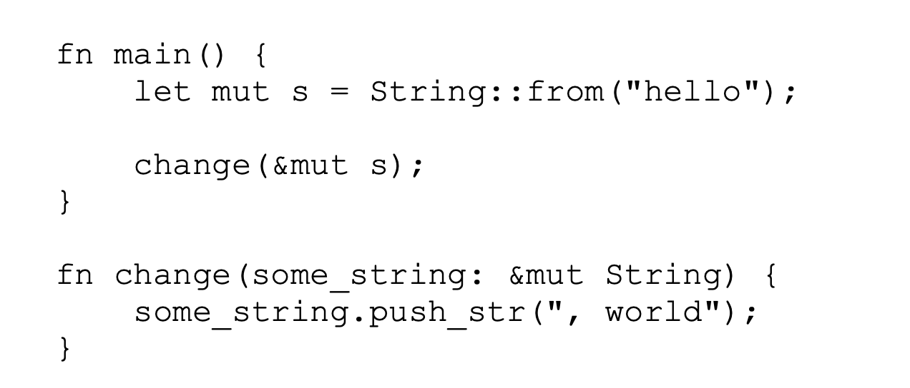

# Rust 编程语言

最大特点：编译期检查、安全、高效

## 入门指南

更为现代化，底层依赖 C & C++，似乎所有的高级语言底层皆依赖于此，具有比较完备的开发工具和工具链 `rustup`

macOS安装 Rust：`curl https://sh.rustup.rs -sSf | sh`

Rust 更新：`rustup update`

Rust 卸载：`rustup self uninstall`

查看当前 Rust 版本号：`rustc --version`

查看 Rust 帮助文档：`rustup doc`

格式化代码：`rustfmt main.rs`

常规的 Hello World 环节：

```rust
fn main() {
    println!("Hello, world!");
} 
```

**带 `!` 的是完成对宏的调用而非普通函数的调用**

使用 `ructc {file}`来完成 `.rs` 文件的编译，编译完成后即可将编译文件交付给别人，无需依赖使用环境，和解释型语言不同

单个文件使用 rust` 足以应付，但大型项目需要构建工具，Rust官方提供了：Cargo，是一个构建系统及包管理器

使用 Cargo 来创建项目：`cargo new {project}`

当前工作目录：

```
project
---- .git
---- Cargo.toml
// 编译后出现，指定当前依赖 Crate 版本，避免默认版本升级导致问题，保证构建可重现，后期如果需要升级，直接修改 Cargo.toml 没用[在 Cargo.toml 当中仅仅指定的是最低版本，因为 Rust Library 要求向后兼容，实际引用的或许不是这个版本]，要使用 cargo update 来完成升级库的检查工作，成功后会再次写入到该文件当中去，默认 0.3.x 无法升级到 0.4.x，需要使用 Cargo.toml 将最低版本改成 0.4.0 [小版本兼容，和 Maven 一样]
---- Cargo.locl
---- src
	---- main.sr
```

Cargo.html 无限接近于 Java 世界当中的 pom.xml

```toml
[package]
name = "hello_cargo"
version = "0.1.0"
edition = "2021"

# See more keys and their definitions at https://doc.rust-lang.org/cargo/reference/manifest.html

[dependencies]
```

使用 Cargo 编译项目：`cargo build`，构建成功的输出在：`target/debug/` 下，可以直接运行，也可以使用 `cargo run` 的方式来依次**完成编译和运行任务**

使用 `cargo check` 来检查是否可以通过编译，而不需要花费额外的时间来生成可执行文件，往往 Rust 开发者会周期性使用这个命令来检查是否能通过编译

> 基于前文所述，Rust 在编译过程当中可以发现绝大多数 Bug，应该是花了大力气在这上面的，所以 check 这条命令很有价值

当修改完成后使用：`cargo build --release` 来完成 release 文件的打包，这种模式会花费更长的编译时间来优化代码，后续的性能基准测试也要基于此


## 猜字游戏

Demo1：Finish input and output

```rust
use std::io;                                                                                           

fn main() {
    println!("Guess the number!");

    println!("Please input your guess.");

  	// variable in rust default is immutable, use mut keyword let variable mutable
    let mut guess = String::new();
  	// let guess = 2

  	// reference is same sa variable default is immutable, use keyword mut let reference mutable
    io::stdin().read_line(&mut guess)
  			// 对 read_line 函数返回的 Result 进行处理，默认都需要处理 Result
  			.expect("Failed to read line");

    println!("You guessed: {}", guess);
}
```

我们通常构建的可执行的包（Crate）是：Binary Crate，而可复用功能库是：Library Crate

需要的依赖包可以在：cargos.io 当中进行搜索


## 通用编程概念

Rust 变量默认不可变，为了可以安全方便的写出复杂，甚至是并行的代码【保证线程安全的几个方式，级别由高到低：线程私有、对象不可变或者事实不可变、线程安全的对象、持有锁来访问的保护对象】，Rust 采用了除去完全避免并发外的最高一种安全级别

Rust 推荐使用在数据类型需要修改的时候使用隐藏机制：使用后面声明的对象代替前面的对象

```rust
let spaces = "     ";
// 已经是不同的数据类型了 从 String -> i32 而无需进行更换名字，推荐使用这种方式进行覆盖
let spaces = spaces.len();
```

常量声明方式：

```rust
// 需要声明数据类型
const MAX_POINTS: u32 = 100_000;
```

Rust 数据类型分两种：标量类型（Scalar：something that has size but no direction）和复合类型（Compound：something that consist of two or more different parts）

Scalar：Rust 内置四种 Scalar 类型：整数、浮点数、布尔值和字符

整型由于大部分机器（包含 64 bit）都是 i32 效率更高，默认使用


> Rust 对益处的处理，在默认的 Debug 环境下会报错 panic，而 release 时候会自动将溢出转换为最小值

浮点类型包含：f32 和 f64 性能相差无几，默认使用 f64

布尔类型：true 和 false，占单个字节

字符类型：使用单引号，占四字节，使用 Unicode 编码

Compound：将多个不同类型的值组合为一个类型，包含元组（tuple） 和数组（array）

元组：**固定长度的数组，可以是不同的类型**，创建完成后不可变

```rust
fn main() {                                                                                            
    let tup = (200, 5.0, true);

    // through destructuring to access element in tuple
    let (x, y, z) = tup;
    println!("{}", x); 
    println!("{}", y); 
    println!("{}", z); 

    // through character . to access element
    println!("through operation . to get result: {}", tup.1);
}
```

数组：**固定长度的数组，必须是相同的类型**，创建完成后不可变

```rust
let array: [i32, 5]= [1, 2, 3, 4, 6];
let array: [i32, 8] = [3 ; 8];
println!("{}", array[1]);
```

Rust 是静态类型语言，意味着需要在编译时候知道所有变量的具体类型，大部分情况下 Rust 编译器可以推导出具体的数据类型来，但有些时候如调用 parse 将 String 转换成 i32 或 u32 的时候此时需要手动注明

Rust 函数的创建和使用：

```rust
fn main() {                                                                                            
    println!("Hello, world!");

    another_function();
    another_function_with_argument(123);
    another_function_with_one_more_argument(123, 'c');
    println!("function plus one return: {}", function_plus_one(2));
}

fn another_function() {
    println!("Another function.");
}

// required explicit insturction argument type
fn another_function_with_argument(param: i32) {
    println!("function with argument print: {}", param);
}

fn another_function_with_one_more_argument(param1: i32, param2: char) {
    println!("first param is : {}", param1);
    println!("second param is : {}", param2);
}

fn function_plus_one(param: i32) -> i32 {
    param + 1 
}
```

函数可以以语句或者表达式结尾，语句是执行操作但不返回值的指令，而表达式是执行操作并返回值的指令，简单判断一个指令是表达式还是语句，可以判断 `let result = <command>` 是否合法，Rust 是一门基于表达式的语言

```rust
let expression_result = {
  let x = 3;
  x + 1			// 没有加上分号，如果加上了就成语句了，而不是表达式了
}
```

条件：

```rust
fn base_branch_operate() {
    let number = 3;

    if number % 4 == 0 {
        println!("number is divisible by 4");
    } else if number % 3 == 0 {
        println!("number is divisible by 3");
    } else if number % 2 == 0 {
        println!("number is divisible by 2");
    } else if number % 1 == 0 {
        println!("number is divisible by 1");
    } else {
        println!("this number not exist!");
    }
}

fn advanced_branch_operate() {
    let condition = true;

    let number = if condition {
        5
    } else {
        6
    };

    println!("number value is {}", number);
}
```

循环：

```rust
fn loop_operation() {
    let mut counter = 0;
        
    let result = loop {
        counter += 1;

        if counter == 10 {
            break counter * 2;
        }   
    };  

    println!("result is {}", result);
}

fn while_operation() {
    let mut number = 3;

    while number != 0 {
        number = number - 1;
    }

    println!("{}", number);
}

fn for_operation() {
    let tuple = [20; 15];

    for element in tuple.iter() {
        println!("element is {}", element);
    }
} 
```


## 所有权

概念：与常规的使用垃圾回收或者手动释放内存的方式不同，所有权是第三种内存管理方式，允许编译器在编译过程当中执行检查工作，而不会产生任何的运行时开销。

> 理解所有权概念需要理解堆栈，Rust 对堆栈的操作有直观的感受，处理器在处理排列紧密的数据（栈）时要比处理排布稀疏的数据（堆）效率高，且寻址次数越多，性能往往越差（缓存优化，较低的跳转次数更大可能命中缓存）
>
> 绝大多数编程语言需要记录你分配的堆空间，最小化堆上的冗余数据。
>
> Rust Scalar类型都是直接在栈上进行分配的，其他的 Compound 数据类型则会直接被分配到堆当中

所有权规则：

* Rust 当中的每一个值都有一个对应的变量作为他的所有者。
* 在同一时间内，值有且仅有一个所有者

```rust
fn main() {                                                                                            
    let string1 = String::from("sample");
  	// rust 当中使用 move 代替浅拷贝，string1 被 move 到了 string2 当中
  	// Rust 永远不会在赋值操作中执行拷贝，因为相当消耗资源，需要手动 clone
  	// 例外：如果是 Scalar 基本数据类型，则直接执行深拷贝操作，因为是存储在栈上，复制相当快
    let string2 = string1;

  	// 此时 string1 已经不可用
    println!("{}",string2);
}
```

* 当所有者离开自己的作用域时，他持有的值就会被释放掉

**将值传递给函数在语义上类似于给变量进行赋值，将变量传递给函数将会触发移动或者复制**


将变量作为方法返回值也可以作为当前变量作用域的延续

为了避免以下代码的产生


Rust 使用引用传递来进行优化，引用允许你在不获取所有权的前提下使用值


这种通过引用传递参数给函数的方法也被称为借用（Borrowing），不允许去修改引用的值，但可以使用可变引用来解



有一个很大的限制是，对一个作用域当中的一个变量只能声明一个可变引用，为了防止竟态条件：

* 两个或两个以上的指针同时访问一片内存空间
* 至少有一个指针会向空间中写入数据
* 没有数据同步的机制

不能在不可变引用指向的变量创建可变引用

* 在任何一段给定的时间里，你要么只拥有一个可变引用，要么只能拥有任意数量的不可变引用
* 引用总是有效的（编译器保证，保证在使用时当前变量未被回收）

Rust 当中持有所有权的两种类型：引用 和 切片，前面都是引用，**切片允许我们引用集合中某一段连续的元素序列，而不是整个集合**

String 切片引用：

```rust
let string = String::from("hello world!");

// 字符串切片
let hello = &string[0..5];
let hello_replace = &string[..5];
let world = &string[6..11];
let world_copy = &string[6..];

let whole_string = &string[..];
```

切片使用：

```rust
fn main() {                                                                                                       
    let source = String::from("hello world");
    let result = first_world(&source);
    println!("{}", result);
  	// 这里会报错：cannot borrow `source` as mutable, as it is not declared as mutable &source
    source.clear();
}

// 定义方法接口时推荐以 字符串切面 代替 字符串引用
fn first_world(source: &str) -> &str {
    let bytes = source.as_bytes();

    for (i, &item) in bytes.iter().enumerate() {
        if item == b' ' {
            return &source[..i];
        }   
    }   

    &source[..]
}
```

字符串字面量就是切面，被存储到二进制程序中，直接以切片  `&str` 的方式来进行引用，正是由于 `&str`是不可变的，因此字符串字面量就是不可变的了。

使用权，借用和切片的逻辑都是为了方便进行清除所有者离开了作用域的数据


## 结构体

Demo：

```rust
// 增加 Debug 打印 trait
#[derive(Debug)]                                                                                       
struct Rectangle {
    width: u32,
    height: u32,
}

fn main() {
    let rectangle = Rectangle {width: 30, height: 50};

    println!("Rectangle info: {:?}", rectangle);

    println!("Rectangle area is {}", area(&rectangle));
}

fn area(rectangle: &Rectangle) -> u32 {
    rectangle.width * rectangle.height
}
```

使用方法来将 area 归属到 struct 当中去

> 函数和方法是两个类型的概念，方法被定义在结构体（枚举类型、Trait对象）的上下文中，并且他们的第一个参数永远是 `slef`，用于代指该方法的结构体实例
>
> > Java 中一切皆对象，静态方法更适合叫内联函数，其他的都是方法

```rust
#[derive(Debug)]                                                                                       
struct Rectangle {
    width: u32,
    height: u32,
}

impl Rectangle {
  	// 通常无需获得所有权，也无需修改
    fn area(&self) -> u32 {
        self.width * self.height
    }   

    fn can_hold(&self, target: &Rectangle) -> bool {
        self.width >= target.width && self.height >= target.height
    }   
}

fn main() {
    let rectangle = Rectangle {width: 30, height: 20};
    let rectangle2 = Rectangle {width: 30, height: 20};

    println!("result: {}", rectangle.can_hold(&rectangle2));
}
```

从属于 struct 的还有一个关联函数，通过函数这个名字知道他无需传入 `&self`，等同于 Java 的静态方法，一般用作构造器

```rust
fn square(size: u32) -> Rectangle {
  Rectangle {width: size, height: size}
}
```


## 枚举与模式匹配

简单的枚举处理：

```rust
#[derive(Debug)]
enum IpAddress {
    IP_V4(String),
    IP_V6(String)
}

fn main() {
    let ip_enum = IpAddress::IP_V4(String::from("123"));
    println!("IpAddress : {:?}", ip_enum);
}
```

`Option<T>`本质上也是一个枚举，其中包含：`NONE` 和 `Some`：

```rust
fn plus_one(x: Option<i32>) -> Option<i32> {
    match x { 
        None => None,
        Some(i) => Some(i + 1)
    }   
}

fn main() {
    let five = Some(5);
    let six = plus_one(five);
    println!("some: {:?}", six);
}

```


